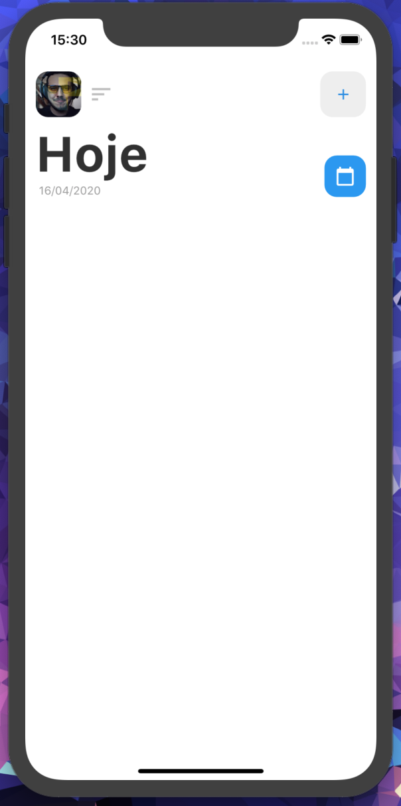
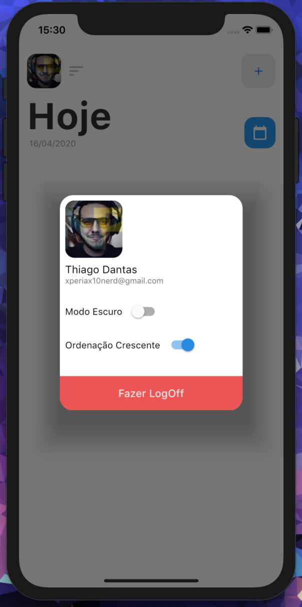
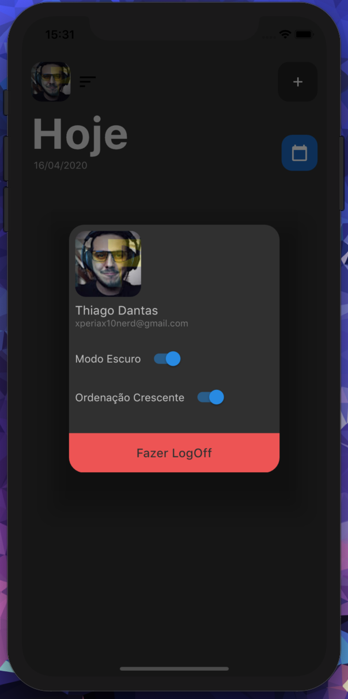
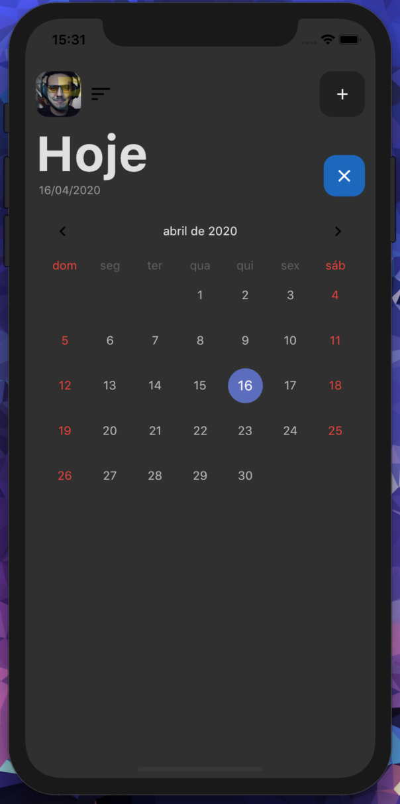
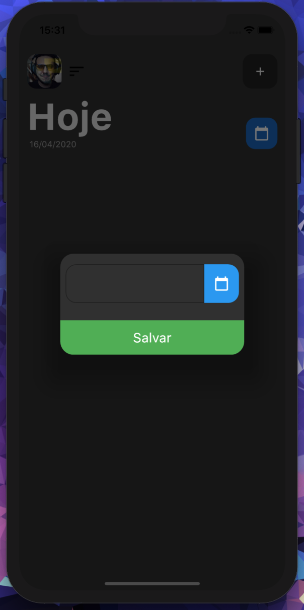
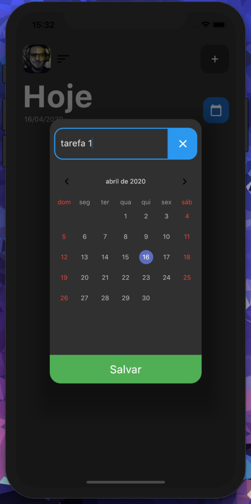
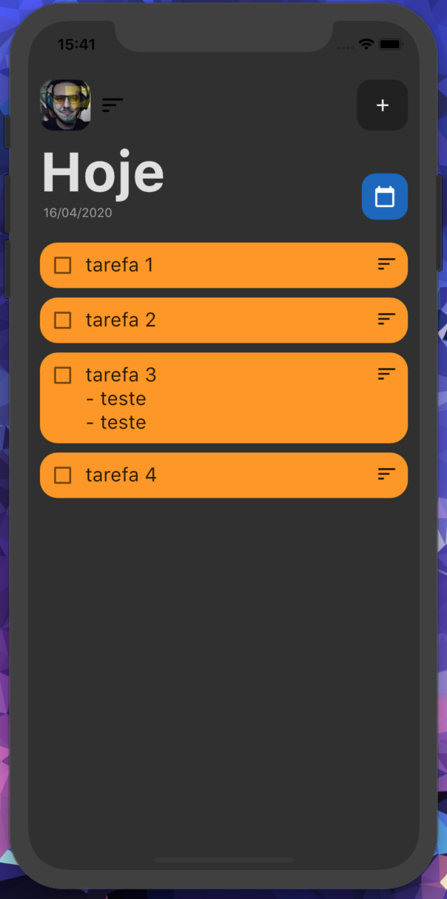
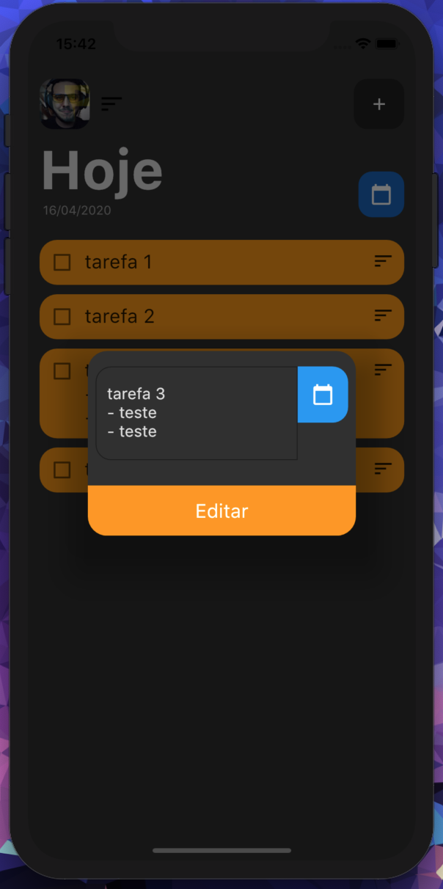
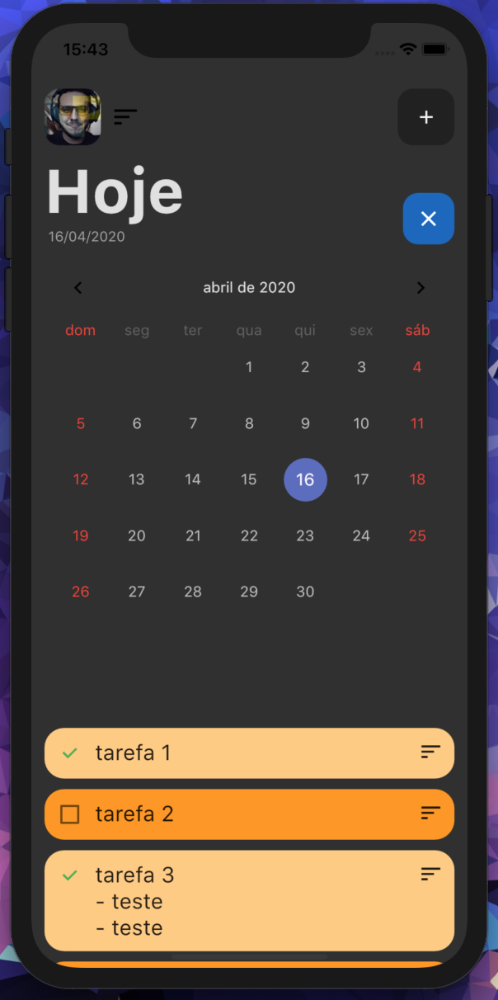
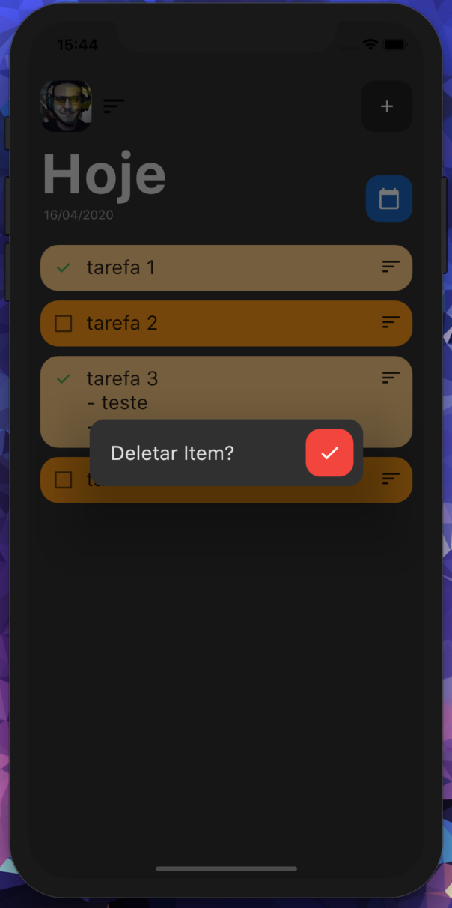

# Flutter_TodoList_Firebase

Aplicativo TodoList desenvolvito em Flutter com integração ao Firebase! 
Com o intuito de armazenar suas tarefas e organizá-las por dia.
  

  

 # O App aborda:

    • Autenticação Google SignIn.
  
    • Armazenamento de dados utilizando o CloudFirestore do Firebase.
    
    • Animações.
  
    • Modo Escuro via SharedPreferences.
  
    • Custom Dialog
    
    • Gerenciamento de estado com MobX.     
    
    • Item de listagem customizado.
    
   
 <h2>Para reproduzir este Projeto:</h2>

- Necessário ter intalado o Dart e o Flutter no ambiente.
- Obtenha a chave SHA-1 do seu projeto ( Necesário para o GoogleSignIN). 

    [Clique aqui para saber como obter o SHA1](https://developers.google.com/android/guides/client-auth).

- Crie um projeto no Firebase.
- Dentro do projeto, em Overview, Crie o app para android(adicionando a chaveSHA1) e/ou ios seguindo os passos informados pelo próprio Firebase.
- Vá na Aba authentication e ative o Login pelo provedor Google, adicionando um email de suporte.
- Vá na Aba Database e ative o banco de dados.
- Após essas configurações feitas o projeto estará aptos a ser executado.

  

 
